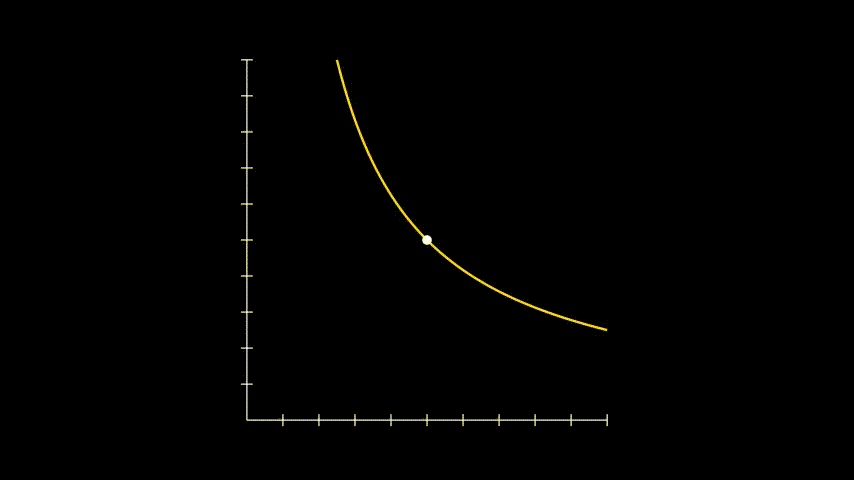

# ink-automated-market-maker-ui

Useful commands:

```
dx serve --hot-reload
```
# License

The source code is made available under the [MIT license](https://github.com/TomaszWaszczyk/ink-automated-market-maker-ui/blob/master/LICENSE). Some of the dependencies are licensed differently, with the BSD license, for example.
